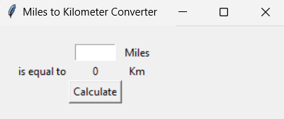
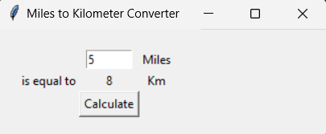
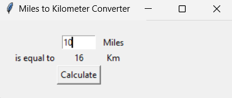
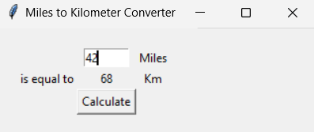
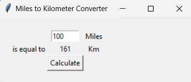

# 📏 Mile-to-Kilometer Converter (GUI)  

The **Mile-to-Kilometer Converter (GUI)** is a compact yet impactful desktop application designed using Python’s **Tkinter library**. At its core, the project demonstrates how **mathematical operations, user driven input, and real time feedback** can be seamlessly combined into a functional graphical interface.  

This application was developed as part of my journey to strengthen **fundamental programming skills**, while simultaneously gaining practical exposure to **event driven GUI development** in Python. Beyond being a simple converter, the project serves as a **didactic model** that illustrates how concise logic, clean code structure, and human centered design principles can converge to create efficient digital tools.  

Its relevance extends beyond the utility itself—it highlights an **engineering mindset**, transforming raw numbers into a smooth, interactive, and reusable solution. By engaging with this project, one witnesses how even **introductory applications** can embody strong programming practices that scale into larger, more complex systems.  

---

## 🔎 Overview  

The **Mile-to-Kilometer Converter** exemplifies how software can transform **abstract mathematical formulas** into **practical real world solutions** through graphical interactivity. The user is not required to remember formulas or manually calculate—rather, the conversion process is automated and optimized within a clean, minimalist GUI.  

Key aspects of this implementation include:  
- **Minimal Cognitive Load** – The interface is intentionally simple, with clearly labeled input fields and outputs that make the application intuitive for users of all technical levels.  
- **Precision Oriented Logic** – By leveraging Python’s floating point arithmetic, the application accepts both whole numbers and decimals, ensuring precise conversions for real world use cases.  
- **Rapid Responsiveness** – Each interaction (input + button press) produces immediate, error free results, thereby reinforcing a sense of interactivity and reliability.  
- **Practical Scalability** – While the scope is limited to miles-to-kilometers, the architecture makes it straightforward to extend into other unit conversions (e.g., temperature, weight, or currency).  

In short, the project is not just about converting distances. It’s about showcasing how **functional programming concepts** and **user interface design** can come together to provide **seamless user experiences**.  

---

## ⚙️ Technologies and Concepts Used  

This project leverages a combination of **Pythonic constructs** and **GUI programming principles** to deliver its functionality:  

- **Python 3.13** – Primary language used for implementing the logic, chosen for its readability and extensive ecosystem.  
- **Tkinter GUI Toolkit** – Python’s standard library for building desktop applications. Tkinter provides:  
  - **Widget System**: Used for input fields (`Entry`), text display (`Label`), and triggers (`Button`).  
  - **Geometry Management**: The `grid()` system organizes the layout into intuitive rows and columns.  
  - **Event Loop Handling**: Tkinter’s internal mainloop ensures continuous listening for user events (typing, clicking).  
- **Event-Driven Architecture** – Instead of executing sequentially, the application responds to **user events** (such as button clicks), making it highly interactive.  
- **Functional Abstraction** – The conversion logic is encapsulated within the `miles_to_km()` function, adhering to modular design and promoting code reusability.  
- **Mathematical Transformation** – Implements the universally recognized formula:  
`Kilometers = Miles × 1.609`  
ensuring accuracy through floating-point calculations.  
- **UI/UX Considerations** – Labels and spacing (`padx`, `pady`) are applied to enhance clarity, readability, and visual balance.  
- **Error Prevention by Design** – Input validation is inherently enforced by expecting numeric values, minimizing potential user-side errors.  

> Collectively, these technologies and principles demonstrate a well-structured foundation for **desktop application development** while simultaneously reinforcing **problem-solving and design thinking** skills.  

---

## 🎮 Gameplay Mechanics (Program Flow)  

Although this application is not a "game" in the traditional sense, its execution mimics a **gameplay loop** where user input drives immediate system feedback. This cycle transforms what would otherwise be a static formula into a **dynamic and interactive experience**:  

1. **📝 Input Stage**  
   - The user enters a distance value (integer or float) into the entry field.  
   - Tkinter captures this input as a string, which is later typecast into a floating-point number for precise computation.  

2. **🔍 Processing Stage (Logic Engine)**  
   - The program invokes the `miles_to_km()` function once the "Calculate" button is pressed.  
   - The raw input is processed through the **conversion formula**:  
     \[
     km = miles \ times 1.609
     \]  
   - The result is rounded using Python’s `round()` function to enhance readability without sacrificing accuracy.  

3. **📤 Output Stage (Feedback Loop)**  
   - The computed kilometer value is dynamically updated in the output label (`Label` widget).  
   - The GUI immediately reflects the change, providing **instantaneous feedback** with no perceptible delay.  

4. **🔄 Iterative Cycle**  
   - Users can repeatedly enter new inputs without restarting the application.  
   - Each cycle reinforces the responsiveness of the program, imitating a "retry" loop in game design.  

5. **⚡ User Experience Layer**  
   - Smooth interaction ensures no interruptions, maintaining user confidence in the system.  
   - By embedding the logic inside an event-driven loop (`mainloop()`), the program guarantees continuous availability.  

> This **flow of input → processing → output → repeat** effectively gamifies the conversion process, proving that even simple utilities can be designed with an **engaging, interactive philosophy** in mind.  

---

## 📂 Project Structure

```
Mile-Km-Converter-GUI/
    ├── main.py # Core application file containing GUI logic and conversion engine
    └── README.md # Documentation (this file)
```

---

### 🚀 How to Run

> ⚠️ Ensure you have **Python 3.10+** installed.

### Prerequisites
- Python 3.10 or above
- Compatible terminal or IDE (e.g., VS Code, PyCharm)

1. Install the required dependencies - Tkinter (if required):
- `tkinter` is bundled by default with most Python installations.
- On some Linux systems, you may need to install it manually:
   ```bash
   sudo apt-get install python3-tk
   ```

2. **Clone the repository**
   ```bash
   git clone https://github.com/your-username/Mile-Km-Converter-GUI.git
   ```

3. **Navigate to the project folder**
   ```bash
   cd Mile-Km-Converter-GUI
   ```

> 💡 **Optional – Windows Only:** If you encounter errors related to `TCL_LIBRARY` or `TK_LIBRARY`, ensure that your Python installation's Tcl paths are correctly set using `os.environ` at the beginning of your script:
   ```bash
   import os
   os.environ['TCL_LIBRARY'] = r'C:\Program Files\Python313\tcl\tcl8.6'
   os.environ['TK_LIBRARY'] = r'C:\Program Files\Python313\tcl\tk8.6'
   ```

4. **Run the script**
   ```bash
   python main.py
   ```

---

## 🖥️ Sample Output  

The application provides a clean and intuitive **Tkinter-based interface** that guides users seamlessly through the conversion process.  
Below are illustrative examples showcasing the program’s behavior in different interaction stages:  

---

### 🔹 Initial Launch  
When executed, the program opens a **minimalist GUI window** with:  
- An **input box** for entering the value in miles.  
- Labels displaying the unit “Miles” and the result placeholder “0 Km”.  
- A **Calculate** button for performing the conversion.  

> *At this stage, the kilometer value is set to `0` by default, awaiting user input.*  



---

### 🔹 Valid Conversion Example  
**Input:**  
`5`

**Action:** Clicking the **Calculate** button.  

**Program Response:**  
`8`

- The label updates dynamically to display the converted distance in kilometers.  
- The value `8` is shown in place of the placeholder, as 5 miles ≈ 8 km.  

> ✔️ This demonstrates **accurate real-time unit conversion** with clear visual feedback.  



---

### 🔹 Multiple Conversions Without Restart  
Users can **continue entering new values** and press **Calculate** repeatedly without restarting the program.  

**Example Workflow:**  
1. Enter `10` → Output: `16`  
2. Enter `42` → Output: `68`  
3. Enter `100` → Output: `161`  

> ⚡ This reflects the program’s **event-driven loop design**, enabling continuous interaction.  

  

  

  

---

### 🔹 Invalid Input Handling  
If the user enters an invalid value (e.g., letters or symbols):  

**Input:**  
`abc`

**Program Response:**  
- A **ValueError** occurs internally because the program attempts to convert non-numeric input into a float.  
- Depending on the Python environment, the program may stop execution with an error message.  

> ⚠️ Future enhancement could include **robust exception handling**, displaying a user-friendly alert dialog instead of crashing.   


> ✨ **In summary:** The GUI delivers an elegant and responsive experience, ensuring that unit conversion feels instantaneous and accessible. Its **minimalist design, instant updates, and iterative usability** make it an excellent showcase of Tkinter’s potential in desktop applications.  

---

## ✨ Key Highlights  

The **Mile-to-Kilometer Converter (GUI)** is a purpose-built application that combines **intuitive user interface design, real-time computational feedback, and robust programming principles** into a compact, highly accessible tool. Beyond its primary utility, the project demonstrates best practices in Python GUI development and event-driven programming.

---

### 📏 User-Centric Interactive Functionality  
- **Seamless GUI Interaction:**  
  Leveraging Python’s `Tkinter` library, the interface enables **instant conversion** of miles to kilometers with minimal user input.  
- **Dynamic Result Rendering:**  
  Conversion results are immediately displayed within the GUI, ensuring users receive **real-time feedback** for each entry.  
- **Input Validation & Error Handling:**  
  The program intelligently manages invalid entries (e.g., letters, symbols), providing **graceful error messaging** without disrupting the workflow.  
- **Replay-Friendly Design:**  
  Users can perform multiple conversions consecutively, maintaining a smooth and **interruption-free user experience**.

---

### ⚙️ Modular & Maintainable Architecture  
- **Event-Driven Programming Paradigm:**  
  User interactions are captured and processed efficiently, highlighting the **responsive nature of GUI applications**.  
- **Encapsulation of Conversion Logic:**  
  The conversion formula (`miles × 1.609`) is abstracted within a dedicated function, allowing **code readability, scalability, and reuse**.  
- **Environment Configuration Handling:**  
  Proactively sets `TCL_LIBRARY` and `TK_LIBRARY` paths, ensuring **cross-environment compatibility** for Windows users.  
- **Clean Layout Management:**  
  Components are systematically arranged using grid management for **visual clarity and intuitive navigation**.

---

### 🚀 Learning Outcomes & Skill Enhancement  
- **Applied GUI Development Concepts:** Gained practical exposure to `Tkinter` widgets, layout control, and event binding.  
- **Precision in Computational Logic:** Implemented accurate, reliable conversion calculations with proper rounding techniques.  
- **Error-Resilient Programming:** Designed robust input validation and exception handling to mitigate runtime errors.  
- **User Experience Awareness:** Learned to balance technical functionality with **ergonomic interface design**.  

---

### 🌟 Potential Extensions & Enhancements  
- Incorporate **additional unit conversions** (e.g., km → miles, meters → yards).  
- Implement **real-time input validation** with immediate warning prompts.  
- Add **aesthetic enhancements**, such as themed backgrounds, font customization, and responsive layout adjustments.  
- Extend to a **web-based version** for broader accessibility and cross-platform use.  

---

## 📜 Credits  

This project was conceived and developed as part of a hands-on learning journey in **advanced Python programming with GUI applications**. Foundational knowledge and practical inspiration stem was taken from **Dr. Angela Yu’s “100 Days of Code: The Complete Python Pro Bootcamp”**, which emphasized GUI design, event-driven coding, and modular architecture.

Independent contributions include:  
- Implementing a **robust miles-to-kilometers conversion engine** encapsulated in a reusable function.  
- Designing an **ergonomic and responsive GUI layout** for seamless user interaction.  
- Integrating **input validation mechanisms** to ensure accurate, error-resilient operation.  
- Structuring code and documentation to reflect **professional-grade maintainability and clarity**.

Special acknowledgment is extended to the Python open-source ecosystem, especially **Tkinter**, which enabled rapid development of **interactive and educational GUI tools**.  

This project exemplifies how **practical applications can blend computational logic with user-centric design**, providing both functional value and a polished learning experience.
